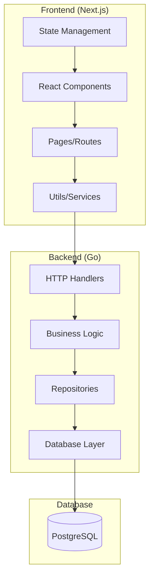
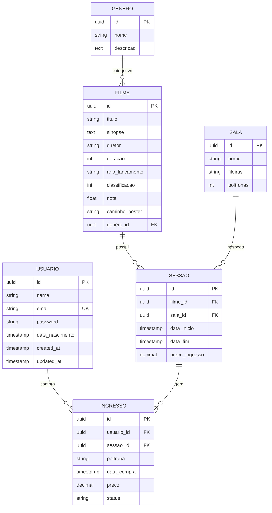
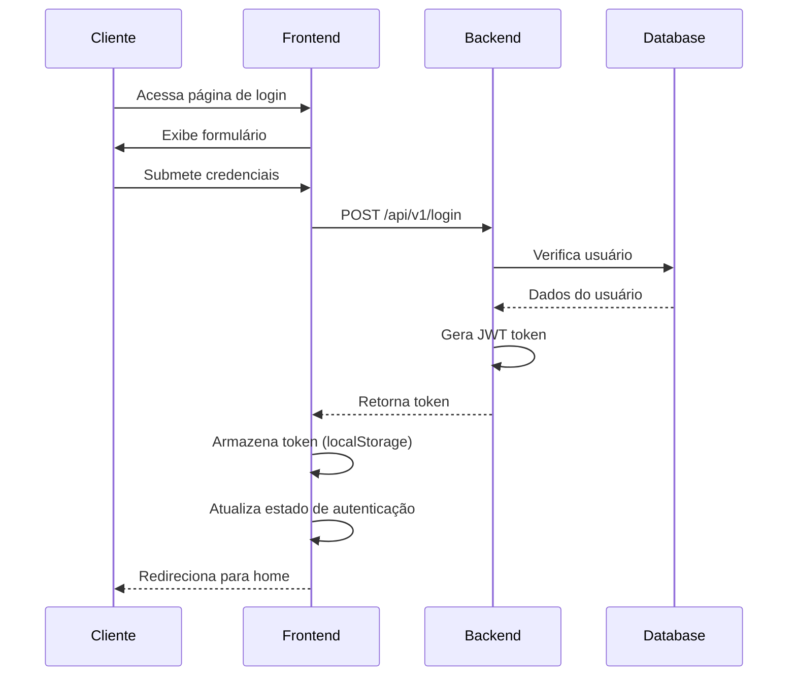
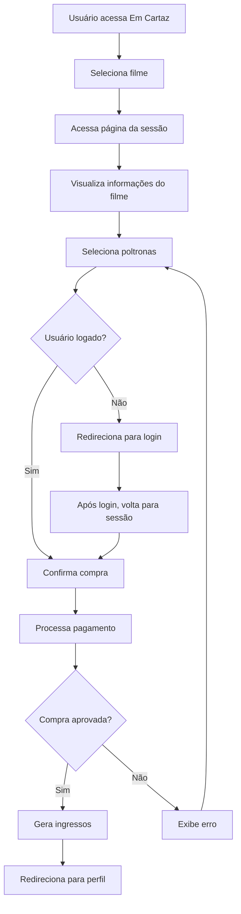
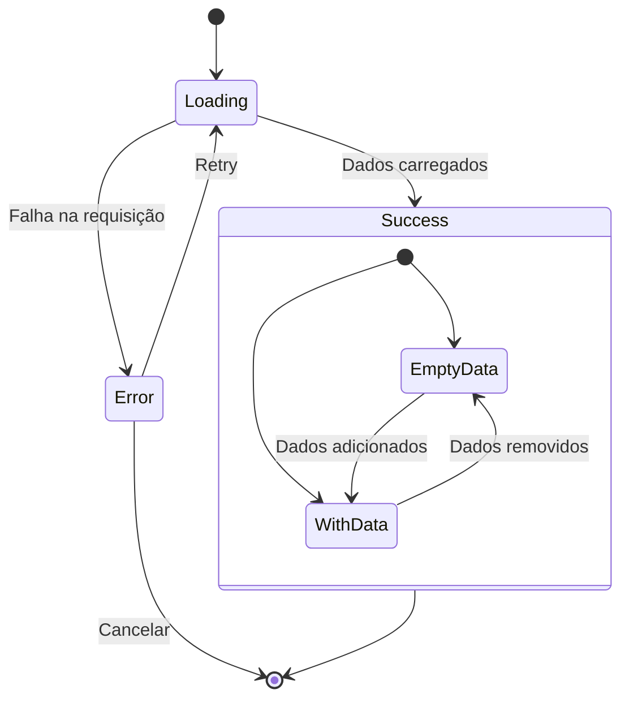
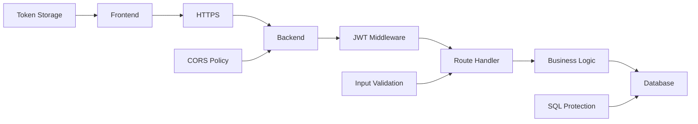
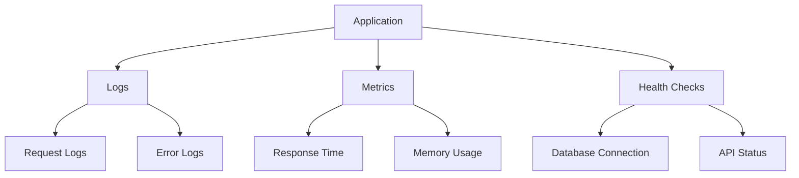

# Cinema Digital - Design Documentation

## 📋 Visão Geral do Sistema

O Cinema Digital é uma plataforma completa para gerenciamento de cinema e venda de ingressos online, composta por um backend em Go e frontend em Next.js/React.

### 🎯 Objetivos

- Permitir navegação e visualização de filmes em cartaz
- Facilitar a compra de ingressos online com seleção de poltronas
- Gerenciar sessões, salas e disponibilidade de assentos
- Oferecer autenticação segura e perfil de usuário

## 🏗️ Arquitetura do Sistema

### Diagrama de Arquitetura



### Backend (Go)

```bash
cinema-digital-go/
├── cmd/
│   └── main.go                 # Ponto de entrada da aplicação
├── internal/
│   ├── adapters/              # Camada de adaptadores
│   │   ├── database/          # Conexão e configuração do banco
│   │   ├── handlers/          # Controllers HTTP
│   │   └── repositories/      # Implementação dos repositórios
│   ├── core/                  # Lógica de negócio
│   │   ├── domain/           # Entidades e interfaces
│   │   ├── services/         # Casos de uso
│   │   └── ports/            # Interfaces para adaptadores
│   └── infrastructure/        # Infraestrutura
│       ├── auth/             # Autenticação JWT
│       ├── config/           # Configurações
│       └── middleware/       # Middlewares HTTP
└── migrations/               # Scripts de migração do banco
```

### Frontend (Next.js)

```bash
front-end-cinema/
├── src/
│   ├── app/                  # App Router (Next.js 13+)
│   │   ├── cadastro/         # Página de cadastro
│   │   ├── login/            # Página de login
│   │   ├── em-cartaz/        # Listagem de filmes em cartaz
│   │   ├── filmes/           # Catálogo completo de filmes
│   │   ├── sessao/[id]/      # Compra de ingressos
│   │   └── perfil/           # Perfil do usuário
│   ├── components/           # Componentes reutilizáveis
│   │   ├── ui/              # Componentes ShadCN
│   │   ├── background/       # Componente de background
│   │   ├── image/           # Componente de imagem
│   │   └── Navbar.tsx       # Navegação principal
│   └── utils/               # Utilitários
│       └── axios.ts         # Configuração da API
```

## 🗃️ Modelo de Dados

### Diagrama Entidade-Relacionamento



### Entidades Principais

#### Usuario

```go
type Usuario struct {
    ID              string    `json:"id"`
    Name            string    `json:"name"`
    Email           string    `json:"email"`
    Password        string    `json:"password"`
    DataNascimento  time.Time `json:"dataNascimento"`
    CreatedAt       time.Time `json:"createdAt"`
    UpdatedAt       time.Time `json:"updatedAt"`
}
```

#### Filme

```go
type Filme struct {
    ID             string  `json:"id"`
    Titulo         string  `json:"titulo"`
    Sinopse        string  `json:"sinopse"`
    Diretor        string  `json:"diretor"`
    Duracao        int     `json:"duracao"`
    AnoLancamento  string  `json:"anoLancamento"`
    Classificacao  int     `json:"classificacao"`
    Nota           float64 `json:"nota"`
    CaminhoPoster  string  `json:"caminhoPoster"`
}
```

#### Sessao

```go
type Sessao struct {
    ID             string    `json:"id"`
    FilmeID        string    `json:"filmeId"`
    SalaID         string    `json:"salaId"`
    DataInicio     time.Time `json:"dataInicio"`
    DataFim        time.Time `json:"dataFim"`
    PrecoIngresso  float64   `json:"precoIngresso"`
    Filme          Filme     `json:"filme"`
    Sala           Sala      `json:"sala"`
}
```

#### Sala

```go
type Sala struct {
    ID        string `json:"id"`
    Nome      string `json:"nome"`
    Fileiras  string `json:"fileiras"`
    Poltronas int    `json:"poltronas"`
}
```

#### Ingresso

```go
type Ingresso struct {
    ID         string    `json:"id"`
    UsuarioID  string    `json:"usuarioId"`
    SessaoID   string    `json:"sessaoId"`
    Poltrona   string    `json:"poltrona"`
    DataCompra time.Time `json:"dataCompra"`
    Preco      float64   `json:"preco"`
    Status     string    `json:"status"`
    Sessao     Sessao    `json:"sessao"`
}
```

## 🔐 Autenticação e Autorização

### Diagrama de Fluxo de Autenticação



### Sistema JWT

- **Token Generation**: Tokens JWT gerados no login com tempo de expiração
- **Middleware**: Verificação automática de tokens em rotas protegidas
- **Storage**: Tokens armazenados no localStorage do cliente
- **Refresh**: Sistema de logout automático em caso de token expirado

### Rotas Protegidas

- `/api/v1/usuarios/logado` - Dados do usuário autenticado
- `/api/v1/usuarios/logado/ingressos` - Ingressos do usuário
- `/api/v1/ingressos` - Compra de ingressos

## 🌐 API Endpoints

### Autenticação

| Método | Endpoint | Descrição |
|--------|----------|-----------|
| POST | `/api/v1/login` | Login do usuário |
| POST | `/api/v1/usuarios` | Cadastro de usuário |

### Usuários

| Método | Endpoint | Descrição |
|--------|----------|-----------|
| GET | `/api/v1/usuarios/logado` | Dados do usuário logado |
| GET | `/api/v1/usuarios/logado/ingressos` | Ingressos do usuário |
| GET | `/api/v1/usuarios` | Listar usuários |
| GET | `/api/v1/usuarios/{id}` | Buscar usuário por ID |
| PUT | `/api/v1/usuarios` | Atualizar usuário |
| DELETE | `/api/v1/usuarios/{id}` | Deletar usuário |

### Filmes

| Método | Endpoint | Descrição |
|--------|----------|-----------|
| GET | `/api/v1/filmes` | Listar todos os filmes |
| GET | `/api/v1/filmes/em-cartaz` | Filmes em cartaz |
| GET | `/api/v1/filmes/{id}` | Buscar filme por ID |
| POST | `/api/v1/filmes` | Criar filme |
| PUT | `/api/v1/filmes/{id}` | Atualizar filme |
| DELETE | `/api/v1/filmes/{id}` | Deletar filme |

### Sessões

| Método | Endpoint | Descrição |
|--------|----------|-----------|
| GET | `/api/v1/sessoes` | Listar sessões |
| GET | `/api/v1/sessoes/em-cartaz` | Sessões em cartaz |
| GET | `/api/v1/sessoes/{id}` | Buscar sessão por ID |
| POST | `/api/v1/sessoes` | Criar sessão |
| PUT | `/api/v1/sessoes/{id}` | Atualizar sessão |
| DELETE | `/api/v1/sessoes/{id}` | Deletar sessão |

### Ingressos

| Método | Endpoint | Descrição |
|--------|----------|-----------|
| POST | `/api/v1/ingressos` | Comprar ingressos |
| GET | `/api/v1/ingressos/poltronas-disponiveis/{id}` | Poltronas disponíveis |

### Salas e Gêneros

| Método | Endpoint | Descrição |
|--------|----------|-----------|
| GET | `/api/v1/salas` | Listar salas |
| GET | `/api/v1/salas/dropdown` | Salas para dropdown |
| GET | `/api/v1/generos` | Listar gêneros |
| GET | `/api/v1/generos/dropdown` | Gêneros para dropdown |

## 🎨 Design System

### Paleta de Cores

- **Primary**: Red-600 (#DC2626) - Elementos principais e CTAs
- **Secondary**: Zinc-800 (#27272A) - Backgrounds de cards
- **Background**: Zinc-900 (#18181B) - Background principal
- **Text**: White (#FFFFFF) - Texto principal
- **Muted**: Zinc-400 (#A1A1AA) - Texto secundário

### Componentes UI (ShadCN)

- **Card**: Container principal para conteúdo
- **Button**: Botões com variantes (primary, secondary, ghost)
- **Badge**: Indicadores de status e categorias
- **Input**: Campos de entrada de dados
- **Tabs**: Navegação entre seções
- **Separator**: Divisores visuais

### Ícones (Lucide React)

- **Film**: Representação de filmes e cinema
- **User**: Perfil e dados pessoais
- **Calendar**: Datas e horários
- **Clock**: Duração e tempo
- **Star**: Avaliações e notas
- **Ticket**: Ingressos
- **MapPin**: Localização e salas

## 🔄 Fluxos de Usuário

### Diagrama de Fluxo de Compra de Ingressos



### Fluxo de Cadastro

1. Usuário acessa `/cadastro`
2. Preenche dados pessoais
3. Sistema valida informações
4. Cadastro é realizado via API
5. Redirecionamento para login

### Fluxo de Login

1. Usuário acessa `/login`
2. Insere credenciais
3. Sistema autentica via JWT
4. Token é armazenado no localStorage
5. Redirecionamento para home
6. Navbar atualiza estado de autenticação

### Fluxo de Perfil

1. Usuário autenticado acessa `/perfil`
2. Visualiza dados pessoais na aba "Informações"
3. Navega para aba "Meus Ingressos"
4. Visualiza ingressos válidos e histórico
5. Pode fazer logout ou navegar para outros filmes

## 🛠️ Tecnologias Utilizadas

### Backend

- **Go 1.21+**: Linguagem principal
- **Gin**: Framework web HTTP
- **GORM**: ORM para banco de dados
- **PostgreSQL**: Banco de dados relacional
- **JWT**: Autenticação via tokens
- **Bcrypt**: Hash de senhas
- **UUID**: Identificadores únicos

### Frontend

- **Next.js 14**: Framework React com App Router
- **TypeScript**: Tipagem estática
- **Tailwind CSS**: Framework de estilos
- **ShadCN/UI**: Biblioteca de componentes
- **Lucide React**: Biblioteca de ícones
- **Axios**: Cliente HTTP
- **React Hooks**: Gerenciamento de estado

## 📊 Estados da Aplicação

### Diagrama de Estados da Interface



### Estados de Loading

- **LoadingState**: Spinner com feedback visual
- **ErrorState**: Mensagem de erro com botão de retry
- **EmptyState**: Estado vazio com call-to-action

### Estados de Dados

- **Sessões**: Lista de filmes em cartaz
- **Poltronas**: Disponibilidade em tempo real
- **Usuário**: Dados de autenticação
- **Ingressos**: Histórico e ingressos válidos

## 🔒 Segurança

### Diagrama de Segurança



### Validações

- **Frontend**: Validação de formulários em tempo real
- **Backend**: Validação de dados na API
- **Autenticação**: Verificação de tokens JWT
- **Autorização**: Middleware de proteção de rotas

### Tratamento de Erros

- **API Errors**: Interceptors para tratamento global
- **Network Errors**: Fallbacks para problemas de conectividade
- **Validation Errors**: Feedback imediato ao usuário
- **Silent Handling**: Erros tratados sem poluir o console

## 🚀 Performance

### Otimizações Frontend

- **Code Splitting**: Carregamento sob demanda
- **Image Optimization**: Componente otimizado de imagens
- **Lazy Loading**: Carregamento progressivo
- **Memoization**: Cache de componentes pesados

### Otimizações Backend

- **Connection Pooling**: Pool de conexões de banco
- **Query Optimization**: Consultas otimizadas com GORM
- **Middleware Caching**: Cache de respostas frequentes
- **Graceful Shutdown**: Encerramento adequado do servidor

## 📱 Responsividade

### Breakpoints

- **Mobile**: < 768px
- **Tablet**: 768px - 1024px
- **Desktop**: > 1024px

### Adaptações

- **Navigation**: Menu hamburger em mobile
- **Cards**: Layout adaptável para diferentes telas
- **Seat Selection**: Scroll horizontal em telas pequenas
- **Forms**: Campos responsivos com melhor usabilidade

## 🔄 Deploy e Ambiente

### Configurações

```env
# Backend (.env)
DB_HOST=localhost
DB_USER=user
DB_PASSWORD=password
DB_NAME=apidb
DB_PORT=54322
JWT_SECRET_KEY=secret-key-api-pattern-go

# Frontend (.env.local)
NEXT_PUBLIC_API_URL=http://localhost:8080
```

### Scripts

```bash
# Backend
go run cmd/main.go

# Frontend
npm run dev
npm run build
npm run start
```

## 📈 Métricas e Monitoramento

### Diagrama de Monitoramento



### Logs

- **Request Logging**: Log de todas as requisições HTTP
- **Error Tracking**: Rastreamento de erros da aplicação
- **Performance Metrics**: Tempo de resposta das APIs
- **User Actions**: Ações do usuário no frontend

### Health Checks

- **Database Connection**: Verificação de conectividade
- **API Endpoints**: Status dos serviços
- **Memory Usage**: Monitoramento de recursos

## 🎯 Casos de Uso Principais

### UC01: Cadastro de Usuário

**Ator**: Usuário não autenticado
**Descrição**: Permite que novos usuários se cadastrem no sistema
**Fluxo Principal**:

1. Usuário acessa página de cadastro
2. Preenche formulário com dados pessoais
3. Sistema valida dados
4. Cria conta no banco de dados
5. Redireciona para login

### UC02: Autenticação

**Ator**: Usuário cadastrado
**Descrição**: Permite login no sistema
**Fluxo Principal**:

1. Usuário insere credenciais
2. Sistema valida no banco
3. Gera token JWT
4. Armazena token no cliente
5. Atualiza interface

### UC03: Visualizar Filmes em Cartaz

**Ator**: Qualquer usuário
**Descrição**: Exibe filmes disponíveis para compra
**Fluxo Principal**:

1. Sistema busca sessões ativas
2. Agrupa por filme
3. Exibe cards com informações
4. Permite navegação para compra

### UC04: Comprar Ingressos

**Ator**: Usuário autenticado
**Descrição**: Permite seleção e compra de ingressos
**Fluxo Principal**:

1. Usuário seleciona sessão
2. Visualiza mapa de poltronas
3. Seleciona assentos disponíveis
4. Confirma compra
5. Sistema gera ingressos

### UC05: Gerenciar Perfil

**Ator**: Usuário autenticado
**Descrição**: Visualiza dados pessoais e ingressos
**Fluxo Principal**:

1. Acessa página de perfil
2. Visualiza informações pessoais
3. Consulta histórico de ingressos
4. Pode fazer logout

## 🔧 Configuração e Instalação

### Pré-requisitos

- Go 1.21+
- Node.js 18+
- PostgreSQL 14+
- Git

### Backend Setup

```bash
# Clone o repositório
git clone <repository-url>
cd cinema-digital-go

# Instale dependências
go mod download

# Configure banco de dados
createdb apidb

# Execute migrações
go run cmd/migrate.go

# Inicie o servidor
go run cmd/main.go
```

### Frontend Setup

```bash
# Entre no diretório frontend
cd front-end-cinema

# Instale dependências
npm install

# Configure variáveis de ambiente
cp .env.example .env.local

# Inicie o servidor de desenvolvimento
npm run dev
```

## 🧪 Testes

### Estratégia de Testes

- **Unit Tests**: Testes de funções isoladas
- **Integration Tests**: Testes de APIs
- **E2E Tests**: Testes de fluxo completo
- **Component Tests**: Testes de componentes React

### Cobertura de Testes

- **Backend**: Handlers, Services, Repositories
- **Frontend**: Componentes, Hooks, Utils
- **API**: Endpoints críticos
- **UI**: Fluxos principais do usuário

---

Este design document serve como referência completa para o desenvolvimento, manutenção e evolução do sistema Cinema Digital, garantindo consistência e qualidade em todas as implementações futuras.
